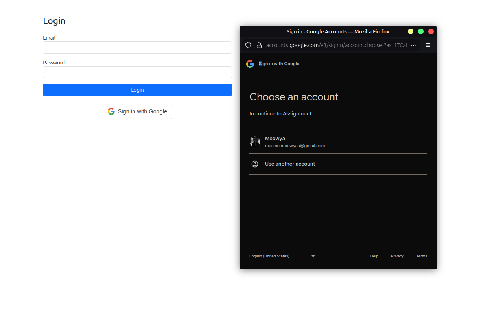
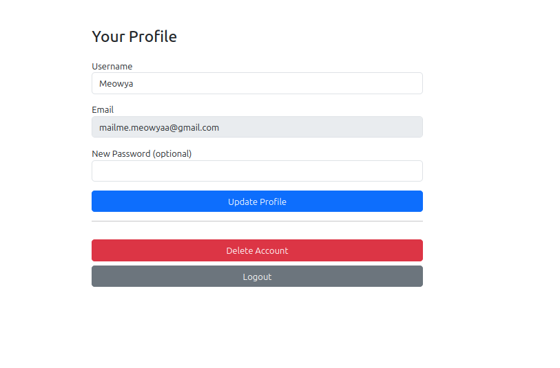

# Multi Auth App

**Multi Auth App** is a simple web application, featuring both traditional email/password login and Google login. Users can register, log in, update their profile, and delete their account. The backend uses JWT for secure authentication.

## 🚀 Features

* 🔐 **Email/Password login & registration**
* 🌐 **Google login integration**
* 📝 **Update profile** (username, email, password)
* ❌ **Delete account**
* 🔑 **JWT-based authentication**
* 💻 Responsive UI with **Bootstrap 5**

## 🛠️ Tech Stack

### Backend

* **Node.js + Express.js**
* **MySQL** (via `mysql2`)
* **JWT** for authentication
* RESTful API structure
* Google OAuth 2.0 for login

### Frontend

* **HTML, CSS, JavaScript**
* **Bootstrap 5**
* LocalStorage for token management

## ⚙️ Setup Instructions

### 📁 Clone the Repository

```bash
git clone https://github.com/yourusername/multi-auth-app.git
cd multi-auth-app
```

### 🧩 Install Dependencies

```bash
npm install
```

### 🛢️ Configure Environment Variables

Create a `.env` file in the root:

```env
PORT=3000
DB_HOST=your_db_host
DB_USER=your_db_user
DB_PASSWORD=your_db_password
DB_NAME=your_db_name
JWT_SECRET=your_jwt_secret
GOOGLE_CLIENT_ID=your_google_client_id
```

### ▶️ Run the Application

```bash
npm run dev
```

App will be available at: [http://localhost:3000](http://localhost:3000)

---

## 📸 Screenshots

**Google Login**

<div align="center">
  
</div>

**Profile Page (after Google login)**

<div align="center">
  
</div>

---

## 🧩 Folder Structure Overview

```bash
multi-auth-app/
├── backend/              # All backend & frontend files are here
│   ├── controllers/      # Authentication logic
│   ├── middleware/       # JWT verification, etc.
│   ├── routes/           # API routes
│   ├── public/           # Frontend HTML/CSS/JS files
│   │   ├── login.html
│   │   ├── register.html
│   │   └── profile.html
│   ├── db.js             # MySQL connection
│   └── server.js         # Express server
├── .gitignore
├── LICENSE
├── README.md
├── google-login.png
└── google-profile.png
```

---

## 🧰 Built Using

<p>
  
  
  
  
  
  
  
  
  
  
</p>

---

## ✍️ Authors

*Initial work* – [grandeurkoe](https://github.com/grandeurkoe)
